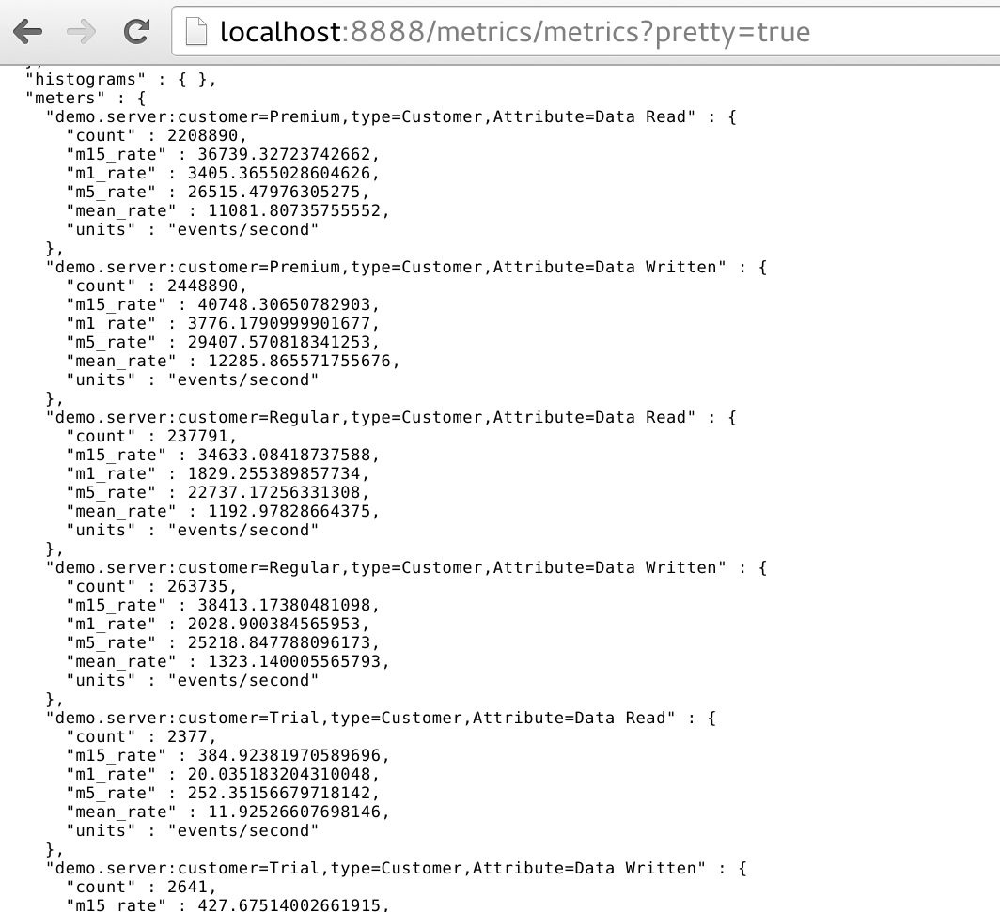
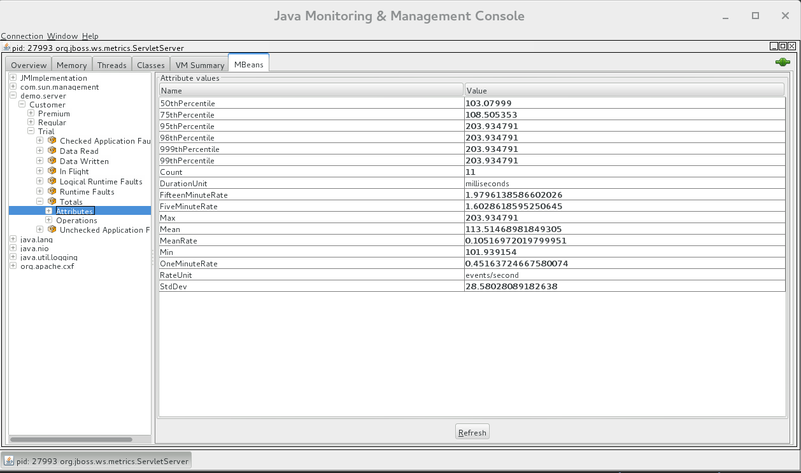

##Throttle And Metrics Demo

This project demostrates the new feature in cxf 3.x to throttle webservice call and new metrics based on dropwizard metrics. 

###Throttle###
In production environment online service like  or , there is 
configuration to limit the requtest per second or minute to make sure web service is not occupied by certain user. Throttling is the important action for the service level agreement.  For some commercial
service, there is pricing for different rate limit for trail and paid user. Customers pay more , they can get more service invocation count or more resources to server her requests.
###Dropwizard Metrics###
To implement this throttling, it needs a metric monitor to know the request count for a period time, then it can take action to throttle the service call. 
Dropwizard metrics provids some simple utitly class to collect different type metric and easily be accessed these metrics through registry from local(same jvm), jmx or rest 
from remote. 
###About this demo###
This demo is a simple webservice is designed to server for 3 level customer, and each level has different request limit. 

|Cumster Level | Request limit|
|------------- | -------------|
|Trail         | Only allow 10 times requests in total  | 
|Regular       |request rate per min < 25 && request rate in 5 minute < 10|
|Premium       |Unlimited     |

Server will reject or slow down the request if it exceeds these limit.  
This demo uses this limit rate to start webservice endpoint, and client will start 4 thread to call this service. Due to trail user request limit, the first Trail customer thread should be all processed and responded, and second Trail customer thread will start 10000 call , but none of the requests will be 
servered due to the request limitation. Another two threads are for "Regular" and "Premium" customer. From the result, you can get the "Regular" customer 
alaways has the slower process speed than the Premium customer.
````java
        //good trail user only call 5 times not exceed the limit
        client = new Client("Trial", ss, 5);
        c.add(client);
        new Thread(client).start();
        
        //429: Exceeded trail user
        client = new Client("Trial", ss);
        new Thread(client).start();
        c.add(client);
        
     
        client = new Client("Regular", ss);
        new Thread(client).start();
        c.add(client);
        
        client = new Client("Premium", ss);
        new Thread(client).start();
````  
Run this demo and simply run **mvn clean install -Pserver** to start server side , and open another terminal to run client with 
**mvn clean install -Pclient**

There is rest api to monitor all the metrics with url .

You can also start jconsole to connect the client or server local process. 


